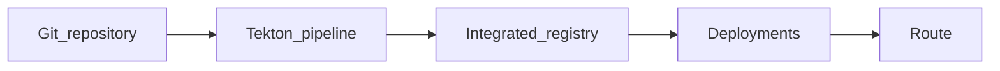

# OpenShift + Tekton deployment guide

High-level steps to deploy **wkpoule** on OpenShift: keep the source in Git, let **OpenShift Pipelines (Tekton)** build container images, push them to the cluster **integrated registry**, and run the app using the manifests under [`openshift/`](openshift/).

Runtime on OpenShift / Docker Compose is **three containers**:

| Container | Image | Build from repo? |
|-----------|--------|------------------|
| **PostgreSQL** | `postgres:16-alpine` | No (pull upstream) |
| **API** | `wkpoule-api` | Yes — **only** [`backend/`](backend/) |
| **Frontend** | `wkpoule-frontend` | Yes — **only** [`frontend/`](frontend/) |

There is **no** Dockerfile at the repository root. Build commands: [`Makefile`](Makefile) (`make build-all`) or explicit `docker build -f backend/Dockerfile backend` / `frontend`. OpenShift: use Git `contextDir` per service — see [`openshift/README.md`](openshift/README.md) and [`openshift/examples/buildconfigs-git.yaml`](openshift/examples/buildconfigs-git.yaml).

Runtime images referenced by deployments (adjust namespace if you rename the project):

- `image-registry.openshift-image-registry.svc:5000/wkpoule-prd/wkpoule-api:latest`
- `image-registry.openshift-image-registry.svc:5000/wkpoule-prd/wkpoule-frontend:latest`

See [`openshift/kustomization.yaml`](openshift/kustomization.yaml), [`openshift/deployment-api.yaml`](openshift/deployment-api.yaml), and [`openshift/deployment-frontend.yaml`](openshift/deployment-frontend.yaml).

---

## End-to-end flow



---

## About `oc`, the web console, and `tkn`

**`oc`** is the OpenShift command-line tool. You use it to log in, switch projects, apply YAML, and inspect pods. You will rely on it throughout.

**`tkn`** is an *optional* extra CLI (“Tekton” CLI) that talks to the same pipelines running on the cluster. It is handy if you prefer the terminal for commands like listing pipeline runs or starting a run from your laptop. **You do not have to install or learn `tkn`:** the OpenShift **web console** has a **Pipelines** section where you can create PipelineRuns, watch logs, and see success or failure. You can also apply pipeline YAML with `oc apply -f …` and use `oc get pipelinerun` without ever installing `tkn`. Treat `tkn` as a convenience, not a requirement.

---

## 1. Prerequisites

- An OpenShift cluster where you (or your platform team) can install operators, create projects, and push images to the namespace.
- **`oc`** CLI installed and logged in (`oc login …`).
- Optional: **`tkn`** CLI to work with Tekton resources from the terminal (see above).
- Decide the **OpenShift project (namespace)** name. This repo defaults to **`wkpoule-prd`**. It must match:
  - `namespace` in [`openshift/kustomization.yaml`](openshift/kustomization.yaml)
  - The middle segment of the image paths in [`openshift/deployment-api.yaml`](openshift/deployment-api.yaml) and [`openshift/deployment-frontend.yaml`](openshift/deployment-frontend.yaml) (`…/wkpoule-prd/wkpoule-api:…`).

**What to do in practice:** Confirm you can open the OpenShift console and run `oc whoami` successfully. If you are not a cluster admin, ask whoever runs the cluster for a **namespace** (project) where you may deploy and for permission to use **pipelines** and **push images** there. Pick one namespace name (e.g. `wkpoule-prd`) and stick to it; every image URL in the manifests must use that same name so Kubernetes pulls from the right place. If your team uses a different convention, edit `kustomization.yaml` and the Deployment manifests (`postgres`, `wkpoule-api`, `wkpoule-frontend`) before you apply anything.

---

## 2. Source code in Git

1. Initialize a repository in this directory (if not already), commit all sources, and add a remote (GitHub, GitLab, Azure DevOps, internal Gitea, etc.).
2. Use a clear **default branch** (e.g. `main`) that the pipeline will clone.
3. **Important:** There is no Dockerfile at the repo root. Postgres uses a public image; your pipeline only **builds two application images** (API from **`backend/`**, frontend from **`frontend/`**), each with its own context directory — see [`openshift/examples/buildconfigs-git.yaml`](openshift/examples/buildconfigs-git.yaml).

**What to do in practice:** On your machine, run `git init` (if needed), `git add`, and `git commit`, then create a repository on your Git host and `git remote add origin …` / `git push -u origin main`. From now on, Tekton will clone **that** URL and branch, so the cluster must be allowed to read it (see step 4). You need a process that builds **`backend/`** into the API image and **`frontend/`** into the frontend image (separate `contextDir` / Docker build contexts); Postgres is not built from this repository.

---

## 3. OpenShift project and base resources

1. Create or select the project:

   ```bash
   oc new-project wkpoule-prd
   ```

   Or use an existing project and set `namespace` in [`openshift/kustomization.yaml`](openshift/kustomization.yaml) accordingly (and update image paths in the deployment YAMLs if the namespace changes).

2. **Secrets:** [`openshift/secret.yaml`](openshift/secret.yaml) defines `wkpoule-secrets` with placeholder values. Before relying on this in production, replace **`DATABASE_URL`**, **`JWT_SECRET_KEY`**, and database credentials with strong, unique values. Do **not** commit real secrets; apply them with `oc apply` from a secure channel or use Sealed Secrets / External Secrets / Vault according to your standards.

3. Apply the stack when you are ready (typically **after** images exist in the registry, or apply everything and let deployments retry until images are present):

   ```bash
   oc apply -k openshift/
   ```

   This applies ImageStreams, Postgres PVC/deployment, API and frontend deployments, services, route, and the secret template.

**What to do in practice:** Run `oc new-project wkpoule-prd` once (or `oc project wkpoule-prd` if it already exists). Before `oc apply -k openshift/`, edit [`openshift/secret.yaml`](openshift/secret.yaml) locally with real database passwords and a strong JWT secret, or plan to patch the Secret later with `oc create secret …` / `oc apply` from a file that never goes to Git. Applying the kustomize folder creates Deployments that expect images to exist; if you have not pushed images yet, pods may sit in `ImagePullBackOff` until step 6 is done—that is normal. You can still apply early so Services, Routes, and ImageStreams exist.

---

## 4. Allow OpenShift (Tekton) to access the Git repository

Tekton’s **git-clone** task (or equivalent) needs credentials for **private** repositories.

- **HTTPS:** Create a **Secret** in the pipeline namespace with basic auth or a token (e.g. GitHub PAT, GitLab deploy token) scoped to **read** the repository. Wire it to the git-clone task per your task’s documentation (`basic-auth` type or `kubernetes.io/basic-auth` with annotations as required).
- **SSH:** Store a deploy key or bot SSH private key in a **Secret** and mount it for SSH-based clone.
- Prefer **read-only** tokens, rotate them on a schedule, and avoid sharing personal user passwords.

**Optional automation:** Trigger a pipeline on every push using OpenShift Pipelines **Triggers** (EventListener, TriggerBinding, TriggerTemplate) and a **webhook** configured in your Git hosting provider. Alternatively, run pipelines manually or on a schedule.

**What to do in practice:** If the repo is **public**, your pipeline may clone without credentials (still follow your org’s policy). If it is **private**, create a read-only token or deploy key in GitHub/GitLab/etc., then in OpenShift create a **Secret** in `wkpoule-prd` (or whichever namespace runs the pipeline) that stores that token or SSH key. When you configure the **git-clone** task in the console or in YAML, point it at that Secret’s name so the clone step can authenticate. Test mentally: from a machine with no cached credentials, could you clone the repo with only that token? If yes, Tekton can too once the Secret is wired correctly.

---

## 5. Install OpenShift Pipelines (Tekton)

1. As a cluster administrator, install **Red Hat OpenShift Pipelines** from **OperatorHub**.
2. Confirm the operator and Tekton components are healthy (e.g. `TektonConfig` CR and pods in `openshift-pipelines` or your operator namespace, depending on version).

**What to do in practice:** Log in to the console as someone with **cluster-admin** (or ask that person to do this once per cluster). Open **Operators → OperatorHub**, search for **OpenShift Pipelines**, install the operator with the defaults your platform recommends. After a few minutes, open **Pipelines** in the left menu; if you see tasks or pipeline options, the operator is usually ready. You do not need `tkn` for this—you only need the operator installed and the console showing pipeline resources.

---

## 6. Build and push to the integrated (local) image registry

The “local” image repository on OpenShift is the **cluster integrated registry**. Images are usually addressed as:

`image-registry.openshift-image-registry.svc:5000/<namespace>/<imagestream-name>:<tag>`

This project’s [`openshift/imagestreams.yaml`](openshift/imagestreams.yaml) defines **ImageStreams** `wkpoule-api` and `wkpoule-frontend`. Your pipeline should push tags that those deployments already reference (e.g. `latest`), or you change deployments to match the tags you push.

### Service account and permissions

Pipeline runs typically use a **ServiceAccount** (often `pipeline` in the namespace). That SA must be able to **push** images to ImageStreams in your project. Grant sufficient role (for example **`edit`** on the namespace, or a tighter custom role that allows image stream updates) following your cluster’s security guidelines.

### Pipeline shape (conceptual)

1. **Clone** the Git repository into a workspace (single clone shared by following tasks).
2. **Build and push API:** context `backend/`, Dockerfile `backend/Dockerfile`, output image `…/wkpoule-api:latest` (or your chosen tag).
3. **Build and push frontend:** context `frontend/`, Dockerfile `frontend/Dockerfile`, output image `…/wkpoule-frontend:latest`.

Implementation options (no YAML required in this doc):

- **Tekton Hub / bundled tasks:** e.g. `git-clone`, **`buildah`** (`buildah bud` + `buildah push`) targeting the internal registry URL.
- Use **ClusterTasks** or namespaced **Tasks** shipped with OpenShift Pipelines, per your cluster version.

**Frontend note:** The frontend image’s nginx config uses `API_HOST`. In Kubernetes, [`openshift/deployment-frontend.yaml`](openshift/deployment-frontend.yaml) sets `API_HOST` to **`wkpoule-api`** (the API Service name). You do not need extra Tekton arguments for that as long as the Service name stays `wkpoule-api`.

**What to do in practice:** In the console (or from YAML you apply with `oc`), define a **Pipeline** that first clones your Git URL into a workspace, then runs a container build for `backend/Dockerfile` and pushes to `image-registry.openshift-image-registry.svc:5000/wkpoule-prd/wkpoule-api:latest`, then does the same for `frontend/` → `wkpoule-frontend:latest`. The exact clicks vary by OpenShift version, but the pattern is always: **source workspace → buildah (or OpenShift build) → push to internal registry**. Ensure the **ServiceAccount** running the pipeline (often `pipeline`) has permission to update **ImageStreams** in your project; binding **edit** on the namespace is a common simple choice. Start a **PipelineRun** from the console, open the logs for each task, and fix clone or push errors until both images show new tags under **Builds → ImageStreams** (or `oc describe imagestream wkpoule-api -n wkpoule-prd`).

---

## 7. Deploy / rollout

- Deployments use **`imagePullPolicy: Always`**. After a successful push, either:
  - Run **`oc rollout restart deployment/wkpoule-api`** and **`oc rollout restart deployment/wkpoule-frontend`**, or
  - Add a final Tekton task that patches or restarts deployments, or use GitOps (e.g. Argo CD) to reconcile when image digests change.

**Route and DNS:** [`openshift/route.yaml`](openshift/route.yaml) exposes the **frontend** service with TLS edge termination. The example host is `wc2026.apps.cloud.kaposi.net`; change `spec.host` to match your cluster’s apps domain and ensure DNS resolves to your cluster ingress.

**What to do in practice:** After the pipeline finishes and images are pushed, Kubernetes still runs the **old** pods until something triggers a new pull. Run `oc rollout restart deployment/wkpoule-api -n wkpoule-prd` and the same for `wkpoule-frontend`, or use **Workloads → Deployments → … → Restart** in the console. Because `imagePullPolicy` is `Always`, new pods fetch the updated `latest` digest. If your Route host is custom, ask your DNS admin for a CNAME (or equivalent) to the cluster’s ingress, or use the default `*.apps` hostname the cluster gives you and update `route.yaml` to match before applying.

---

## 8. Verification checklist

- `oc get pods -n wkpoule-prd` — API, frontend, and Postgres pods **Running** and ready.
- Open the **Route** URL in a browser; the SPA should load.
- API health: `https://<your-route-host>/api/health` (or call the API service directly from inside the cluster on port 8000).
- Exercise **login / registration** and a few authenticated API calls.

**What to do in practice:** Run `oc get pods -n wkpoule-prd` and confirm three app components: **postgres**, **wkpoule-api**, and **wkpoule-frontend** are ready (not CrashLoop). Open **Networking → Routes**, click the frontend URL, and check the site loads. Append `/api/health` to that same host if your Route and nginx proxy expose the API path (per your ingress setup), or port-forward the API service temporarily with `oc port-forward svc/wkpoule-api 8000:8000` and open `http://127.0.0.1:8000/api/health`. Finally log in or register a test user to confirm the database and JWT secret from step 3 work end to end.

---

## 9. Optional next steps

- Version-control your **Pipeline**, **Tasks**, and **Trigger** objects under e.g. **`.tekton/`** or **`openshift/pipelines/`** and apply them with `oc apply` or GitOps.
- Use **Pipeline as Code (PAC)** to drive Tekton from definitions in the Git repo (GitHub / GitLab integration).
- Hardening: **NetworkPolicies**, resource quotas, backup strategy for Postgres, and secret management beyond plain `Secret` YAML are out of scope for this overview but recommended for production.

**What to do in practice:** Once the first deployment works, copy the Pipeline and Task YAML you created in the console (or export them with `oc get pipeline … -o yaml`) into this repo under **`openshift/pipelines/`** so the next environment can `oc apply` the same definitions. If you use **Pipeline as Code**, you instead add a small bootstrap repo or annotations so Git pushes update the pipeline automatically; that is worth exploring when you are tired of clicking “Start” manually. **If you later install `tkn`**, you can run `tkn pipeline start` or `tkn pipelinerun logs` from your laptop for faster feedback—but the console remains enough for everything above.

---

## Application database (subgroups and schema changes)

The API uses SQLAlchemy models under [`backend/app/models/`](backend/app/models/). New tables (e.g. **subgroups**, **subgroup_members**, **subgroup_invites**, **subgroup_messages**) are created when you run [`backend/seed_data.py`](backend/seed_data.py) or any process that calls `Base.metadata.create_all(bind=engine)` after importing `app.models`. **Existing PostgreSQL databases** that were created before those models were added need the new tables applied once: either run `create_all` against the same DB (safe for additive tables) or add an Alembic migration. Rebuild and redeploy the API image after pulling code that introduces new models.

---

## Reference: manual image push (without Tekton)

**What to do in practice:** If you want to skip Tekton until later, install Docker (or Podman) on your workstation, log in to the internal registry with `oc whoami` and `oc whoami -t` as in the snippet below, build both images locally from `backend/` and `frontend/`, tag them with the full registry path including your namespace, and push. Then restart the two deployments. This proves your cluster accepts images and your manifests work before you invest time in pipeline YAML.

For a one-off test, you can build locally and push to the integrated registry (replace namespace if needed). Example pattern (also sketched in [`openshift/kustomization.yaml`](openshift/kustomization.yaml)):

```bash
REG=$(oc registry info --public=false)
docker login -u "$(oc whoami)" -p "$(oc whoami -t)" "$REG"
docker build -t wkpoule-api:latest ./backend
docker build -t wkpoule-frontend:latest ./frontend
docker tag wkpoule-api:latest "$REG/wkpoule-prd/wkpoule-api:latest"
docker tag wkpoule-frontend:latest "$REG/wkpoule-prd/wkpoule-frontend:latest"
docker push "$REG/wkpoule-prd/wkpoule-api:latest"
docker push "$REG/wkpoule-prd/wkpoule-frontend:latest"
```

Then restart deployments or wait for the next pull if policies and tags align.
