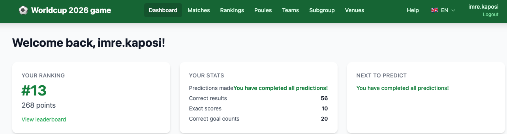
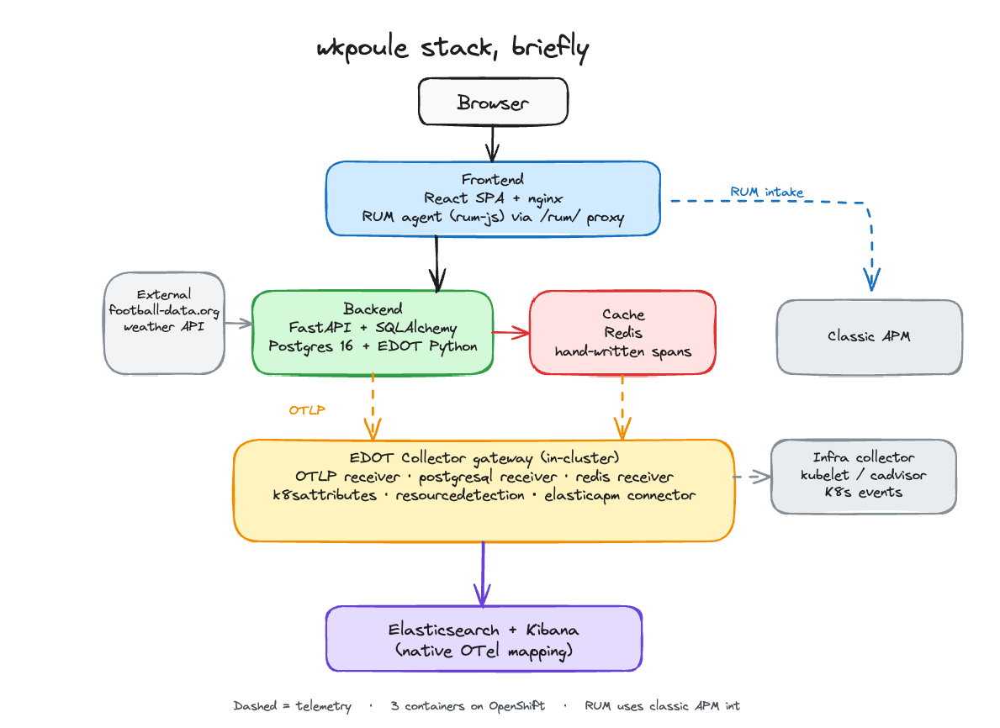
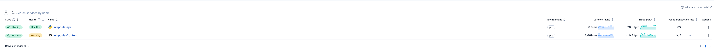
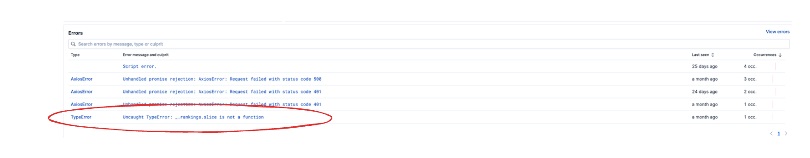
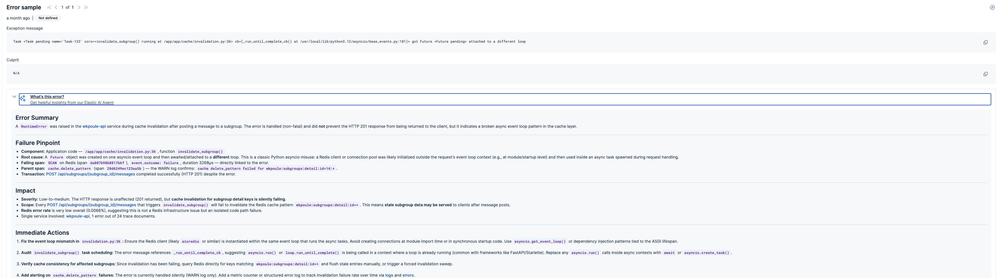
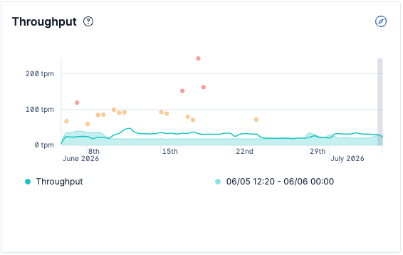
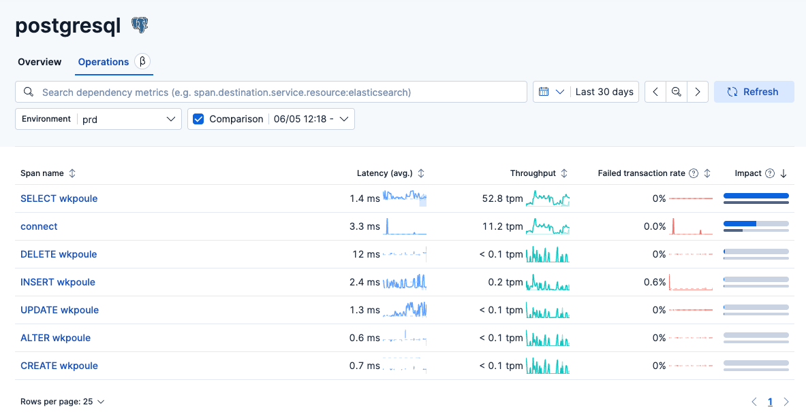
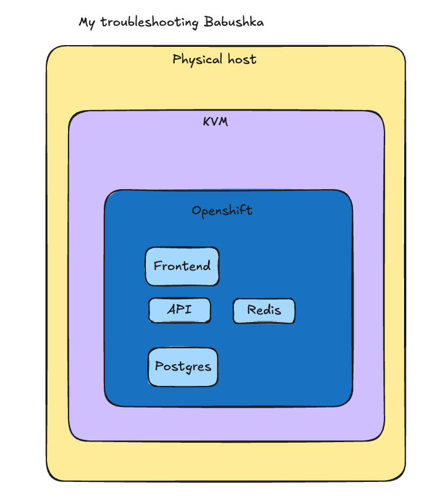
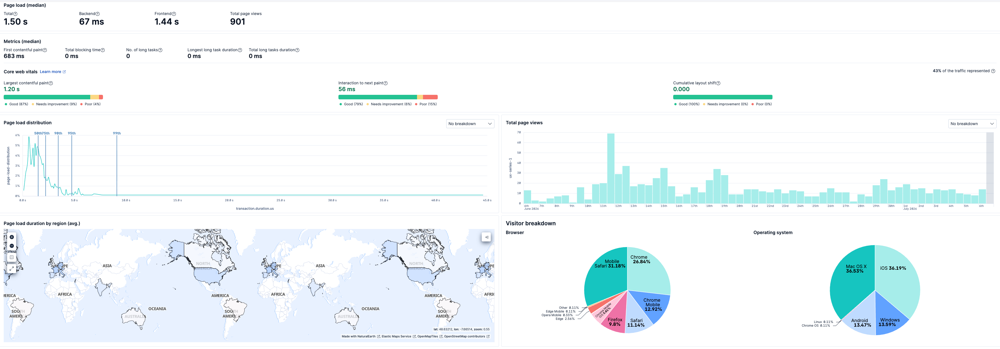
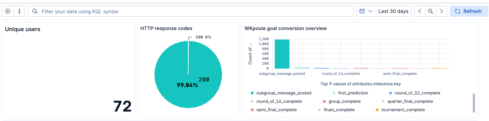

# 5 bugs, 12x traffic, 0.005% errors: what a hobby World Cup app's telemetry actually caught

*A consulting architect, not a developer, runs this on Kibana's AI Assistant and Cursor, and its own telemetry caught a live bug mid-sentence while this post was being written.*

A hobby World Cup prediction app just surfaced five real production bugs through nothing but its own telemetry, including one caught mid-write of this post. Over the last 30 days it handled 2.1 million backend transactions at a 99.995% success rate and absorbed a 12x traffic spike with flat p95 latency. Nobody was watching a dashboard for any of it, because I'm not a professional developer: I'm a consulting architect who runs this on [Kibana's AI Assistant](https://www.elastic.co/guide/en/observability/current/obs-ai-assistant.html) and Cursor instead.

I built [wkpoule](https://wc2026.apps.cloud.kaposi.net) as a side project: a World Cup 2026 prediction game for friends and family. Register, predict every match's score, get points for correct outcomes/scores/goal counts, watch a leaderboard update. Nothing exotic: FastAPI + Postgres on the backend, a React SPA on the front, three containers on OpenShift.



I also decided to instrument it like it mattered: full OpenTelemetry traces, metrics and logs via [Elastic's EDOT distribution](https://www.elastic.co/opentelemetry), real user monitoring in the browser, Postgres and Redis receivers, the whole thing shipped into an [Elastic Observability](https://www.elastic.co/observability) deployment. For a game a few dozen people use to argue about penalty shootouts.

That turned out to be the best decision I made on this project. Not because the site is under heavy load (it isn't) but because a hobby project is exactly where you *don't* have a team of people watching dashboards, filing tickets, or reproducing bug reports for you. The telemetry had to do that job by itself. This post is the story of five times it did, told with the actual data pulled live from the cluster.

## The stack, briefly



- **Backend**: FastAPI (Python 3.12) + SQLAlchemy + Postgres 16, auto-instrumented with the [Elastic Distribution of OpenTelemetry (EDOT)](https://www.elastic.co/opentelemetry) Python agent.
- **Frontend**: React SPA behind nginx, instrumented with the [Elastic APM RUM agent](https://www.elastic.co/guide/en/apm/agent/rum-js/current/index.html) (`rum-js`) proxied through `/rum/`.
- **Cache**: Redis, added mid-tournament, with hand-written spans and metrics around every cache operation.
- **Collector**: an EDOT Collector (Elastic Stack / EDOT version 9.4.2) running as a gateway in-cluster: OTLP receiver for app traces/logs/metrics, plus dedicated `postgresql` and `redis` receivers polling both databases directly, all funneled through `k8sattributes`, `resourcedetection`, and an `elasticapm` connector/processor so the data shows up correctly in [Kibana's](https://www.elastic.co/kibana) APM views, not just raw Discover.
- **Infra**: a second collector deployment scrapes kubelet/cadvisor stats and Kubernetes events for the OpenShift side of the picture.
- **External data**: live scores polled every 15 minutes from [football-data.org](https://www.football-data.org/)'s API (logs and retries on the next cycle if it errors); match-day temperatures from a separate weather API with a hardcoded fallback (see Case file #4).
- **Destination**: [Elasticsearch](https://www.elastic.co/elasticsearch), via the native OTel mapping mode; no separate APM Server for the backend, though the frontend RUM agent still talks classic APM intake.

None of this was required for a football pool app. All of it ended up load-bearing.

## Getting the pipes working was its own project

Before there was anything to observe, there was a slog of getting observability itself to work, worth naming because "add OpenTelemetry" is often treated as a checkbox rather than a project. The commit history tells the real story:

```text
dd5bb0c Added observability components
4de046e troubleshooting lack of logging arriving via OTLP
e325128 RUM working, now detailing and adding postgres o11y
5cd3acd otel gateway2gateway config
4573da7 troubleshooting fix otel fastapi
c18d756 troubleshooting fix otel sqlalchemy
c3436bf rum troubleshooting
faa0cf0 rum troubleshooting again
959c997 more troubleshooting otel
a24f3f7 OTEL fixes, infra metrics in. Extra backend audit events
46b718d k8s events receiving otel
```

Eleven commits just to get traces, RUM, Postgres metrics and Kubernetes events flowing cleanly into Elasticsearch: logs that silently weren't arriving over OTLP until `logging_config.py` and the collector config both got reworked, a k8s-scoped `ServiceAccount` that needed exact RBAC to avoid 403s from the informer. This is the unglamorous tax you pay before observability starts paying you back. It's worth budgeting for on any project, not just this one.

RUM was its own multi-commit slog for a different reason. I went with the classic Elastic APM RUM agent (`rum-js`) instead of an OTel-native browser SDK because it's still the more feature-complete option client-side. The catch: my Elastic deployment isn't reachable from the public internet, so a browser sitting on `wc2026.apps.cloud.kaposi.net` can't just call the APM intake endpoint directly. The fix was a virtual path on the frontend's own reverse proxy: nginx forwards everything under `/rum/` to the private APM endpoint server-side, so the browser only ever talks to the same host it already loaded the page from:

```nginx
location /rum/ {
    proxy_pass ${RUM_APM_UPSTREAM}/;
    proxy_set_header Host ${RUM_APM_HOST};
    ...
}
```

Same-origin as far as the browser's concerned, private on the wire the whole way through. It's also why RUM lands in a separate ingestion path from the OTLP gateway the backend uses: two different agents, two different intake mechanisms, both routed through the one reverse proxy the deployment actually exposes.

## Case file #1: Displayed Errors catches a live crash

On **May 29**, I introduced pagination on the rankings endpoint: `/api/rankings` started returning `{ items, total, page, ... }` instead of a bare array. I updated the obvious call sites and shipped it.

The **Displayed Errors** panel on the frontend service's entry in [Kibana's Services view](https://www.elastic.co/docs/solutions/observability/apm/services) found what I'd missed within the hour:





> `TypeError: _.rankings.slice is not a function`, thrown in the minified frontend bundle, browser runtime, one error group, timestamped `2026-05-29T15:02:34Z`.

Pulling that error straight from the cluster confirms it happened exactly once, at exactly that timestamp:

```text
2026-05-29T15:02:34.529Z  TypeError: _.rankings.slice is not a function
```

Here's the part I haven't mentioned yet: I didn't work out the root cause myself. I asked [Kibana's built-in AI Assistant](https://www.elastic.co/guide/en/observability/current/obs-ai-assistant.html) to explain the error right there in the Services view, and its answer is, almost word for word, the commit message that shipped the fix:

> **Root cause signal:** `_.rankings` is not an array at the point `.slice()` is called. This likely means the API response from `wkpoule-api` returned rankings in an unexpected shape (e.g., an object instead of an array, or missing entirely), or the frontend failed to initialize the field correctly.
>
> **Immediate actions:** Inspect the API response shape... Add a defensive guard in the frontend... Upload sourcemaps for v1.7.0... Check for recent API or schema changes...

I pasted that analysis straight into Cursor as the prompt and let it write the actual fix. That's not a detail I'm glossing over: as a consulting architect rather than a developer by trade, "read a minified stack trace and intuit the root cause" was never going to be my step in this process. Kibana's Assistant did the diagnosis, Cursor did the typing, and I did the part I'm actually qualified for: deciding it was worth fixing, and checking afterward that it stayed fixed. The commit message reads like an incident report because it *is* one: AI-generated, committed verbatim instead of paraphrased, which turned out to be a genuinely useful paper trail months later while writing this post.

Some component was still calling `.slice()` on `rankings` assuming it was an array, but it was now an object with an `.items` field. The fix, which Cursor produced from that prompt, was a small normalization layer:

```ts
// frontend/src/utils/rankings.ts
export function rankingsItems(
  rankings: PaginatedResponse<ParticipantRanking> | ParticipantRanking[] | null | undefined,
): ParticipantRanking[] {
  if (!rankings) return [];
  if (Array.isArray(rankings)) return rankings;
  return Array.isArray(rankings.items) ? rankings.items : [];
}
```

Every page that consumes rankings now goes through `rankingsItems()` regardless of which shape the API hands back. I checked the RUM error index going back to day one for this project: across everything ever captured from the frontend, **11 browser errors total**, and that `TypeError` occurs exactly once: May 29, 15:02:34 UTC, never again. That's the kind of confirmation you don't get from "I tested it locally and it seemed fine": the error group's entire lifetime is visible, start to (permanent) end.

## Case file #2: caching arrives, and immediately breaks async

Redis caching landed in phases through early June: read-through caching for rankings, matches, subgroups, teams, with a `CacheService` that fails open (a Redis outage degrades to "always recompute," never a 500). Two commits after the "phase 4" rollout:

```text
ac359b0 implemented caching phase 4; o11y
5a46d32 rum hotfix
8cdf6d6 cache async bug
```

This time the tip-off came from the same place as Case file #1: a quiet `RuntimeError` in `wkpoule-api`'s error rate, and Kibana's AI Assistant explaining it before I'd even opened the trace.



Its hypothesis: a Redis client instantiated outside the request's event loop, most likely at module import time or in synchronous startup code, then reused inside an async task spawned during request handling. Not quite the final answer, but close enough to send me straight to the right file. Tracing `invalidate_subgroup()` in `cache/invalidation.py` further, the pattern turned out to be site-wide, not local to that one function: several FastAPI routes in this codebase are still synchronous `def` handlers (not `async def`), which Starlette runs in a thread pool. Cache *invalidation* from those routes tried to run an async coroutine with `asyncio.run()` inside that worker thread, but the shared Redis client was bound to the main uvicorn event loop. The invalidation coroutine and the connection pool it needed lived on two different event loops that never talked to each other. Nothing crashed; invalidations just silently failed to fire, so stale cache entries could outlive their intended lifetime.

The fix captures the real application loop at startup and schedules invalidation onto *that* loop from any thread:

```python
def set_main_event_loop(loop: asyncio.AbstractEventLoop) -> None:
    """Store the FastAPI/uvicorn loop so sync routes can schedule cache tasks on it."""
    global _main_loop
    _main_loop = loop

def run_cache_task(coro: Awaitable[Any]) -> None:
    try:
        loop = asyncio.get_running_loop()
    except RuntimeError:
        loop = None
    if loop is not None:
        task = loop.create_task(coro)
        task.add_done_callback(_log_cache_task_result)
        return
    app_loop = _main_loop
    if app_loop is not None and app_loop.is_running():
        future = asyncio.run_coroutine_threadsafe(coro, app_loop)
        future.add_done_callback(_log_cache_task_result)
        return
    asyncio.run(coro)  # last resort, e.g. tests
```

The AI Assistant's own impact read on the error was reassuring: a 0.0066% Redis error rate, one failure out of 24 trace documents, isolated to this one code path rather than a Redis infrastructure problem, and the `POST /api/subgroups/{subgroup_id}/messages` request that triggered it still completed with a normal 201. Exactly the shape of bug this whole post keeps running into: nothing broke, so nothing but the telemetry would have told me.

A technical review of this very post caught a smaller version of the same disease in the fix above: the `loop.create_task(coro)` branch didn't originally attach `_log_cache_task_result` the way the `run_coroutine_threadsafe` branch does, so a failed invalidation on that path skipped the structured `wkpoule.cache` warning log entirely; it would still surface, eventually, as asyncio's generic "Task exception was never retrieved," on whatever schedule the garbage collector felt like. Same class of bug as the original one, one level down: not a crash, just one failure path quietly excluded from the same visibility as all the others. Fixed by attaching the callback there too, with a regression test that fails on the old code by asserting the structured log line actually appears.

## Case file #3: one recompute, verified against the traffic curve

Before caching existed, `/api/rankings` and `/api/rankings/me` both called `compute_participant_rankings()` (a full walk of every participant's predictions) on *every single request*. Fine at low traffic. Not fine once the tournament actually started and people began checking the leaderboard obsessively.

On **June 11**, one day before the group stage traffic ramp, this shipped:

```python
async def get_cached_participant_rankings(db: Session) -> list[ParticipantRanking]:
    """Return the full rankings table, computing at most once per TTL window."""
    def compute() -> _ParticipantRankingsCache:
        return _ParticipantRankingsCache(rankings=compute_participant_rankings(db, None))
    cached = await cached_call(CacheKeys.rankings_all(), RANKINGS_TTL, _ParticipantRankingsCache, compute)
    return cached.rankings
```

Both `/rankings` and `/rankings/me` now share one Redis-cached computation per 60-second window, no matter how many people hit either endpoint in that window.

Here's the part I like: I didn't have to take this on faith. I pulled the actual daily latency of `GET /api/rankings/me` straight from the traces around that date:

| Date | Requests | Avg | p95 |
|---|---:|---:|---:|
| Jun 05 | 59 | 38.2 ms | 88.2 ms |
| Jun 08 | 33 | 35.2 ms | 94.0 ms |
| Jun 10 | 64 | 43.7 ms | 126.7 ms |
| **Jun 11 (fix ships)** | 200 | 48.7 ms | 119.5 ms |
| Jun 13 | 244 | 58.3 ms | 108.5 ms |
| Jun 14 | 700 | 63.1 ms | 116.4 ms |
| Jun 17 | 658 | 62.0 ms | 115.5 ms |
| Jun 18 | 737 | 58.1 ms | 102.2 ms |

Traffic to that one endpoint went up roughly **12x** in a week as the tournament kicked off, and p95 latency stayed essentially flat, in the 100–140ms band, the entire time. That's the fix working exactly as intended; it just wasn't a dramatic before/after cliff, because it shipped the day before the load spike, not after. Observability here does two things: find the bug, and prove the fix actually held under the load it was built for, using the same trace data either way.



## Case file #4: a bug nobody ever saw, because it was designed not to be seen

The spec for this game asks for "expected temperature during match in celsius," a genuinely unnecessary feature I added because it's fun. It calls [api.weatherapi.com](https://www.weatherapi.com/)'s forecast endpoint, which only covers a 14-day horizon; anything further out falls back to a table of hardcoded historical city averages.

Querying the error logs for the whole life of the project, one exception dominates everything else: **511 occurrences**, all `error.exception.handled: true`:

```text
IndexError: list index out of range
  File "/app/app/services/weather.py", line 127, in _fetch_forecast
    day = data.get("forecast", {}).get("forecastday", [{}])[0]
```

It clusters hard around **June 17–19** (214, 229, 50 occurrences on those three days respectively), exactly the window where a wave of newly scheduled knockout matches crossed into and back out of the 14-day forecast window, and WeatherAPI's response occasionally came back with an empty `forecastday` array instead of the expected single entry. `except Exception` catches it, logs it with full context, and returns `None`, which the caller turns into a historical average instead of a temperature.

No user ever saw this. No page ever errored. And yet I can tell you, months later, exactly which external dependency degraded, exactly which city (Mexico City, in the sample I pulled), exactly which line of code, and exactly how often, because the handler logs structured attributes on every failure:

```python
logger.exception(
    "weather API call failed",
    extra={
        "event.action": "external_api_request",
        "event.outcome": "failure",
        "integration.name": "weatherapi",
        "url.domain": "api.weatherapi.com",
        "weather.city": city,
    },
)
```

This is the case for instrumenting your *fallbacks*, not just your failures. A silently degraded feature is still a degraded feature; the only question is whether you find out from a dashboard or from a confused user asking why Casablanca shows 18°C in July.

## Why the cache is worth it, even at a 35% hit rate

The instinct, looking at what's coming, is "you built a whole Redis layer, spans, metrics, a Kibana dashboard and cache-invalidation plumbing, for an endpoint that peaks at a few hundred requests a day, that's overengineered for a friends' pool." I'd have said the same thing a month ago. The reason it isn't true has nothing to do with request latency.

This runs on OpenShift, on dedicated cloud servers with old-fashioned spinning disks, not the SSD-backed, over-provisioned infrastructure this kind of app usually gets deployed on. That single fact changes what "efficient" means. The scarce resource here isn't CPU or even Postgres query time; it's IOPS on one shared disk, and that disk isn't just mine. It's also where OpenShift's own control plane, **etcd**, does every write, and etcd is brutally unforgiving of disk write latency. [OpenShift's own recommended etcd practices](https://docs.okd.io/4.18/scalability_and_performance/recommended-performance-scale-practices/recommended-etcd-practices.html) put the healthy threshold at a **p99 `fsync` duration under 10 milliseconds**, not seconds, about one frame or less at 60fps.





Every layer in that stack (OpenShift, the containers, Postgres, Redis) is a nested doll sitting on the same physical disk as etcd. None of the app-level metrics this project collects see through to that disk directly; the physical host is the layer underneath everything else being watched.

Miss that consistently and etcd doesn't degrade politely: it starts missing heartbeats, calls a leader election, and the node hosting it gets flagged unhealthy by the rest of the cluster. Every request I keep off Postgres isn't shaving 40ms off a response; it's one fewer write standing between a spinning disk and the one process the entire control plane depends on staying alive.

I didn't have to take this on faith. The Kubernetes event stream this project is already collecting shows it happening:

- **`EtcdLeaderChangeMetrics`** events (the cluster's own control plane losing its leader and re-electing) averaged about **54/day** in the six weeks before the tournament started, then roughly **tripled to ~161/day** once traffic and release cadence picked up in mid-June, peaking at 288 in a single day.
- **`NodeNotReady`** events, normally near zero, spiked to **474** on **June 27** (the day `v2.7.0` shipped) and another **140** the day after.

June 27 is the clean example, because the app's own logs from that exact evening tell the rest of the story:

```text
20:05:22  WARN   Redis ping failed: Error 111 connecting to redis:6379. Connection refused.
20:05:47  WARN   Redis ping failed: Timeout connecting to server
23:01:10  WARN   Redis ping failed: Timeout connecting to server
23:03:01  ERROR  sqlalchemy.exc.OperationalError: connection to server at "postgres" (172.30.23.110),
                 port 5432 failed: Connection refused
23:04:35  ERROR  Application startup failed. Exiting.
23:05:15  WARN   Redis unavailable at startup (fail-open): Error 111 connecting to redis:6379. Connection refused.
```

A routine feature deploy triggered a rolling restart; the incoming API pod's startup lifespan runs `Base.metadata.create_all()` against Postgres before it will serve a single request. At the exact moment several pods were restarting, pulling images, and re-registering with the node at once, Postgres itself became briefly unreachable (not slow, refused), the new pod's startup failed outright, and it had to retry until the node settled down. That's a disk-pressure symptom, not an application bug: nothing in the Python code was wrong, the node it was running on was simply saturated.

Which is why I don't judge this cache by the number I originally set out to hit. I wrote myself an internal plan when I added Redis (`docs/redis-caching-observability-test-coverage-plan.md`) with a stated success criterion of **cache hit rate > 80%**. Here's what the `wkpoule.cache.hit` / `wkpoule.cache.miss` OTel counters actually show over the last 7 days:

| Endpoint | Hits | Misses | Hit rate |
|---|---:|---:|---:|
| subgroups | 1,174 | 1,101 | 51.6% |
| matches | 940 | 1,722 | 35.3% |
| rankings | 761 | 1,245 | 37.9% |
| teams | 0 | 17 | 0% |

Nowhere close to 80%, and I'm leaving that number here on purpose: dashboards are only useful if you let them contradict the plan you wrote before you had data. Part of the gap is exactly what it looks like: TTLs are 60–120 seconds, and at this request volume most keys expire before they get reused enough times to pay off. `teams` sitting at a flat, suspicious 0% turned out not to be a traffic problem at all; see the cache-corruption bug below, which affected every endpoint caching a bare `list[Model]`, `teams` included.

None of that changes the actual argument for the cache, though, because it was never about the 80% target. Even a mediocre 35% hit rate on `/api/matches` means roughly a third of what would have been a live Postgres round-trip (times however many people are refreshing at that exact second) never touches the disk at all. When twenty people reload after a goal, the difference between "twenty new Postgres queries" and "one Postgres query plus nineteen Redis reads" is nineteen fewer write-queue neighbors for etcd's own fsync, and on this hardware, that's the difference between a slow page and a control-plane hiccup that takes the whole node sideways. I don't have a direct disk-latency metric to point to (the collector isn't scraping node-level iostat, only Postgres/Redis/container metrics), so this part is inference from the etcd and node-readiness signal plus knowing what the underlying boxes are, not a measured disk queue depth. But the correlation is specific enough (a named release, a named hour, a named node event, a named connection-refused log line) that I'm comfortable calling it cause and effect rather than coincidence.

So: the hit-rate numbers above are honest, and they don't mean the caching effort wasn't worth it. On this infrastructure, the metric that matters isn't the percentage of requests served from Redis; it's the absolute count of requests that *didn't* have to touch the one disk that OpenShift's own brain also depends on.

## Who's actually playing

RUM's geo-IP enrichment turned an assumption ("it's me and a dozen people I know") into a map. Real sessions over the last 30 days, by country:

Australia, Brazil, Japan, the Netherlands, Spain, Germany, Ireland, Italy, France, the UK, India, Singapore, Lebanon, the US, Austria, Canada, Costa Rica, Hong Kong.

I did not build a marketing funnel for this. It's a private prediction pool. That list is entirely word-of-mouth, and I only know it exists because RUM tags every session with client geo data. Global median page load across all of that: **1.50 seconds** (**67ms** backend, **1.44s** frontend), across 901 recorded page views, with headless-Chrome traffic (synthetic checks, not real visitors) already filtered out.



The volume behind that map, over the last 30 days: **2,119,457** backend transactions, **105** failures (a 99.995% success rate) with **82** ERROR-level and **2,612** WARN-level log lines total. 9,139 successful logins against 83 failed ones (people mistyping passwords, not a credential-stuffing pattern), 3,495 prediction submissions, 1,245 gamification "milestone achieved" events, and a steady trickle of 43 new registrations even mid-tournament.



## Case file #5: the bug this blog post found

While pulling the numbers above, I noticed something in the last few days of WARN-level logs that had nothing to do with anything I was looking for:

```text
2026-07-03T09:17:09.570Z  cache get_json failed for wkpoule:subgroups:directory:user=40:
  5 validation errors for list[SubgroupDirectoryOut]
  0
    Input should be an object [type=model_type, input_value="id=11 name='8D' member_c...
```

Same shape, different `user=N`, several times a day, going back weeks. Nobody filed a bug: the fail-open cache design means this always falls back to a live recompute, so every request still returns correct data. It's just that the cache for this one endpoint has, as far as I can tell, *never actually worked*.

Tracing it through the code: `CacheService.set_json()` only serializes with `model_dump_json()` when the value handed to it is itself a Pydantic `BaseModel`:

```python
async def set_json(self, key: str, value: Any, ttl: int) -> bool:
    ...
    if isinstance(value, BaseModel):
        payload = value.model_dump_json()
    else:
        payload = json.dumps(value, default=str)
```

The subgroup directory endpoint caches a **list** of `SubgroupDirectoryOut` objects, a `list`, not a `BaseModel`, so it falls into the `else` branch. `json.dumps` doesn't know how to serialize a Pydantic model, so it calls `default=str` on each item, which stringifies every object into something like `"id=11 name='8D' member_c..."`, Pydantic's `__repr__`, not JSON. That gets written into Redis as a JSON array of strings. Every subsequent read tries to validate that array against `list[SubgroupDirectoryOut]`, fails because each element is a string instead of an object, logs a warning, and recomputes from Postgres instead.

The fail-open design did exactly its job: zero user-facing impact, ever, on this endpoint. But it also means the bug had zero *visible* impact, which is precisely why it survived multiple releases undetected. It also wasn't limited to this one endpoint: anywhere the codebase cached a bare `list[SomeModel]` instead of a model wrapping a list (the subgroups directory, the virtual-groups standings, the teams list) hit the exact same `json.dumps(value, default=str)` fallback. That lines up with the cache hit-rate table above: `teams` sat at a flat **0%** hit rate, not because teams data is unusually volatile, but because every single read of that cache was failing validation before this fix.

I fixed it after finishing the numbers above, by teaching `set_json` to serialize through a `TypeAdapter` built from the value's own runtime type whenever it isn't already a `BaseModel`:

```python
@staticmethod
def _encode_json(value: Any) -> str:
    if isinstance(value, BaseModel):
        return value.model_dump_json()
    try:
        return TypeAdapter(type(value)).dump_json(value).decode("utf-8")
    except Exception:
        return json.dumps(value, default=str)
```

`TypeAdapter(list).dump_json([...])` knows how to walk into each `BaseModel` element and serialize it properly, instead of falling back to `str()` on anything it doesn't recognize, the same mechanism `get_json` already used on the read side via `TypeAdapter(model).validate_json(...)`, just applied symmetrically on the write side. A regression test (`test_set_json_round_trips_bare_list_of_models`) locks in the exact failure mode: round-tripping a plain `list[BaseModel]` through the cache now produces real JSON objects, not reprs, and the full backend suite (230 tests) still passes. This is the cleanest example I have of this whole post's thesis: **a system that never crashes still needs someone reading its logs, because "handled gracefully" and "working correctly" are not the same claim.** Once you've read the log, the fix itself is usually small.

## What I'd tell someone setting this up from scratch

- You don't have to be a developer to run this loop. Observability's job is to produce a good enough explanation that an AI coding agent can act on it without you translating in between: feed the diagnosis to the agent verbatim, don't summarize it yourself first. My actual contribution to most of these fixes was noticing the alert existed and deciding it mattered.
- Budget real time for wiring up observability itself: RUM intake, collector RBAC, and log delivery over OTLP are their own mini-project, not a one-line SDK import.
- Instrument your fallback paths, not just your failure paths. The weather bug and the cache-corruption bug were both "handled," and both were completely invisible without structured logs carrying enough context (`weather.city`, `cache.endpoint`, the actual Redis key) to diagnose from the log line alone, no reproduction needed.
- A fail-open cache is the right call for a hobby project, but "fail open" silently converts correctness bugs into pure performance bugs. Watch the hit-rate metric, not just the error rate: an endpoint stuck at 0% hit rate is a bug wearing a "everything's fine" costume.
- Let the data argue with your plan. My own caching plan said >80% hit rate; the traffic this app actually gets says otherwise. Both facts are worth keeping.
- Know what's underneath your cluster before you judge a caching layer by its hit rate. On SSD-backed, over-provisioned infrastructure, a 35% hit rate might genuinely not be worth the complexity. On spinning disks shared with etcd, every request that skips Postgres is one less write competing with the control plane for the same spindle; the metric that matters is the request you *didn't* make, not the percentage.
- If you can query your own error groups' full history, do it before assuming a fix worked. "It hasn't happened since the deploy" is a much stronger claim when you can show zero recurrences across the error group's entire lifetime, not just since you started paying attention.

The World Cup will be over in a few weeks and this app will go quiet until 2030. The telemetry doesn't know that, and it caught a real, currently-live bug in the ten minutes it took me to write the paragraph above. That's a pretty good return on instrumenting a football pool like it was something that mattered.
