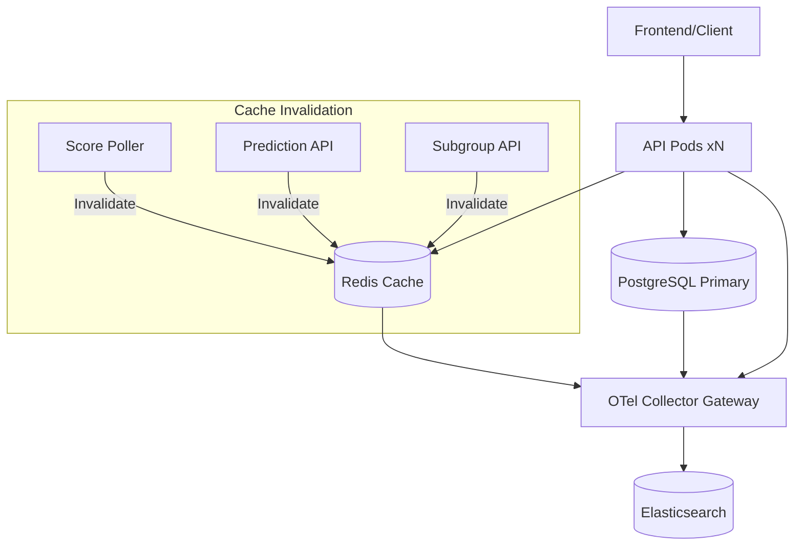

# Redis Caching, Observability & Test Coverage Improvement Plan

## Overview
Add Redis caching layer for performance-critical endpoints, ensure full observability of Redis operations, and increase test coverage from 70% to 80% for both backend and frontend.

## Current State Analysis
- **Backend**: FastAPI + SQLAlchemy (sync), PostgreSQL, OpenTelemetry via EDOT
- **Frontend**: React + Vite + nginx, Elastic APM RUM
- **Infrastructure**: OpenShift with OTel Collector gateway, PostgreSQL single replica
- **Test Coverage**: Backend 70% gate, Frontend ~50% thresholds

## Implementation Plan

### Phase 1: Redis Infrastructure (Week 1)

#### 1.1 Add Redis to OpenShift
**File**: `openshift/deployment-redis.yaml` (new)
- Redis 7-alpine Deployment with 1 replica (start)
- Service `redis:6379`
- PVC for persistence (optional, for session data)
- Add to `openshift/kustomization.yaml`

#### 1.2 Update Backend Dependencies
**File**: `backend/requirements.txt`
```
redis>=5.0.0
aioredis>=2.0.0  # for async support later
```

**File**: `backend/requirements-dev.txt` (add for testing)
```
fakeredis>=2.20.0
pytest-asyncio>=0.23.0
```

#### 1.3 Redis Configuration
**File**: `backend/app/config.py` (add to Settings class)
```python
redis_url: str = "redis://redis:6379/0"
redis_max_connections: int = 20
redis_socket_timeout: int = 5
redis_socket_connect_timeout: int = 5
```

### Phase 2: Redis Client & Caching Layer (Week 1-2)

#### 2.1 Create Redis Client Module
**File**: `backend/app/cache/redis_client.py` (new)
- Connection pool with configurable limits
- OpenTelemetry instrumentation for Redis commands
- Health check endpoint
- Graceful degradation (fail-open for cache misses)

#### 2.2 Create Cache Service Abstraction
**File**: `backend/app/cache/service.py` (new)
```python
class CacheService:
    async def get(self, key: str) -> Optional[str]
    async def set(self, key: str, value: str, ttl: int) -> bool
    async def delete(self, key: str) -> bool
    async def get_json(self, key: str, model: Type[T]) -> Optional[T]
    async def set_json(self, key: str, value: Any, ttl: int) -> bool
```

#### 2.3 Add Cache Invalidation Utilities
**File**: `backend/app/cache/invalidation.py` (new)
- Pattern-based invalidation for related keys
- Event-driven invalidation (match score updates → invalidate rankings)

### Phase 3: Cache Key Endpoints (Week 2)

#### 3.1 Identify Cache Candidates (High Impact)
| Endpoint | Current Load | Cache TTL | Invalidation Trigger |
|----------|--------------|-----------|---------------------|
| `GET /api/rankings/me` | High | 60s | New prediction, score update |
| `GET /api/rankings` | High | 60s | Any prediction, score update |
| `GET /api/matches` | Medium | 300s | Match status change |
| `GET /api/matches/{id}` | Medium | 300s | Match status/score change |
| `GET /api/subgroups/{id}` | Medium | 60s | New message, member change |
| `GET /api/predictions/virtual-groups` | High (compute) | 120s | User's new prediction |
| `GET /api/teams` | Low | 3600s | Rare changes |

#### 3.2 Implement Caching in Routers
**Files to modify**:
- `backend/app/routers/rankings.py` - cache rankings endpoints
- `backend/app/routers/matches.py` - cache match listings
- `backend/app/routers/predictions.py` - cache virtual groups
- `backend/app/routers/subgroups.py` - cache subgroup details
- `backend/app/routers/teams.py` - cache team data

#### 3.3 Add Cache Invalidation on Writes
**Files to modify**:
- `backend/app/routers/predictions.py` - invalidate rankings/virtual-groups on prediction upsert
- `backend/app/services/score_sync.py` - invalidate rankings/matches on score updates
- `backend/app/routers/subgroups.py` - invalidate subgroup on message/member changes

### Phase 4: Observability for Redis (Week 2)

#### 4.1 Instrument Redis Operations
**File**: `backend/app/cache/redis_client.py`
- Add OpenTelemetry spans for all Redis commands
- Record cache hit/miss metrics (Counter)
- Record latency histogram for Redis operations
- Add Redis connection pool metrics (gauge)

#### 4.2 Update OTel Collector for Redis
**File**: `openshift/otel-collector.yaml`
- Add `redis` receiver for Redis metrics
- Configure `redis` exporter to Elasticsearch

#### 4.3 Add Redis Dashboards/Alerts
**File**: `openshift/redis-dashboard.json` (new) - Kibana dashboard
- Cache hit rate
- Redis latency (p50, p95, p99)
- Connection pool usage
- Memory usage
- Key expiration rate

### Phase 5: Test Coverage to 80% (Week 2-3)

#### 5.1 Backend: Increase Coverage Gate
**File**: `.github/workflows/ci.yml`
```yaml
# Change from 70 to 80
--cov-fail-under=80
```

#### 5.2 Add Missing Unit Tests (Backend)
**New test files needed**:
- `backend/tests/unit/cache/test_redis_client.py` - Redis client behavior
- `backend/tests/unit/cache/test_cache_service.py` - Cache service logic
- `backend/tests/unit/cache/test_invalidation.py` - Invalidation patterns
- `backend/tests/unit/test_redis_integration.py` - Integration with fakeredis

**Existing files to expand coverage**:
- `backend/tests/unit/test_virtual_standings.py` - Virtual standings computation
- `backend/tests/unit/test_group_rankings.py` - Group ranking logic
- `backend/tests/unit/test_scoring.py` - Edge cases in scoring
- `backend/tests/unit/test_prediction_lock.py` - Lock timing edge cases
- `backend/tests/unit/test_bracket_resolver.py` - Knockout bracket logic

#### 5.3 Frontend: Increase Coverage Thresholds
**File**: `frontend/vite.config.ts`
```typescript
thresholds: {
  lines: 80,
  statements: 80,
  branches: 75,
  functions: 80,
}
```

#### 5.4 Add Missing Frontend Tests
**New test files needed**:
- `frontend/src/utils/rankings.test.ts` - Ranking calculations
- `frontend/src/utils/predictions.test.ts` - Prediction formatting
- `frontend/src/components/VirtualGroupStandings.test.tsx` - Expand
- `frontend/src/pages/Dashboard.test.tsx` - Dashboard data loading
- `frontend/src/context/AuthContext.test.tsx` - Expand auth flows

### Phase 6: Load Testing & Validation (Week 3)

#### 6.1 Create Load Test Script
**File**: `scripts/load-test.ts` (new)
- Simulate prediction submission burst
- Test cache hit rates under load
- Validate Redis connection pool sizing

#### 6.2 Performance Benchmarks
- Baseline: current API latency without cache
- With cache: measure hit rate, latency improvement
- Redis connection pool saturation point

## Architecture Diagram



## Files to Create/Modify Summary

### New Files (~15)
- `openshift/deployment-redis.yaml`
- `openshift/redis-dashboard.json`
- `backend/app/cache/__init__.py`
- `backend/app/cache/redis_client.py`
- `backend/app/cache/service.py`
- `backend/app/cache/invalidation.py`
- `backend/tests/unit/cache/test_redis_client.py`
- `backend/tests/unit/cache/test_cache_service.py`
- `backend/tests/unit/cache/test_invalidation.py`
- `backend/tests/unit/test_redis_integration.py`
- `frontend/src/utils/rankings.test.ts`
- `frontend/src/utils/predictions.test.ts`
- `frontend/src/pages/Dashboard.test.tsx`
- `scripts/load-test.ts`

### Modified Files (~12)
- `backend/requirements.txt`
- `backend/requirements-dev.txt`
- `backend/app/config.py`
- `backend/app/main.py` (add Redis lifespan)
- `backend/app/routers/rankings.py`
- `backend/app/routers/matches.py`
- `backend/app/routers/predictions.py`
- `backend/app/routers/subgroups.py`
- `backend/app/routers/teams.py`
- `backend/app/services/score_sync.py`
- `openshift/kustomization.yaml`
- `openshift/otel-collector.yaml`
- `.github/workflows/ci.yml`
- `frontend/vite.config.ts`

## Risks & Mitigations

| Risk | Mitigation |
|------|------------|
| Cache stampede on cold start | Use `SETNX` with lock, populate asynchronously |
| Stale data on cache miss | Short TTLs (60-120s), fail-open design |
| Redis single point of failure | Start with 1 replica, plan for Sentinel/Cluster later |
| Connection pool exhaustion | Monitor pool usage, set sensible limits (20) |
| Test flakiness with fakeredis | Use real Redis in CI integration tests |

## Success Criteria

1. ✅ Redis deployed and observable in Elastic
2. ✅ Cache hit rate > 80% on cached endpoints
3. ✅ API p95 latency reduced by > 50% for cached endpoints
4. ✅ Backend test coverage >= 80% (CI gate passes)
5. ✅ Frontend test coverage >= 80% (CI gate passes)
6. ✅ Zero cache-related production incidents in first week